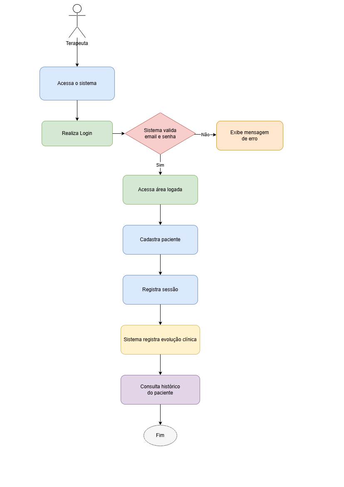

# TeraSaúde

## Descrição do Projeto

O TeraSaúde é um sistema desenvolvido como parte do Trabalho de Conclusão de Curso, com o objetivo de auxiliar terapeutas ocupacionais na organização dos atendimentos, cadastro de pacientes, registro de sessões e acompanhamento da evolução clínica.

A proposta do projeto surgiu a partir da dificuldade que muitos profissionais possuem em manter os registros dos pacientes de forma organizada, principalmente quando utilizam anotações manuais, agendas físicas ou arquivos separados.

Com o sistema, o terapeuta poderá centralizar as informações dos pacientes, registrar atendimentos e consultar o histórico de evolução de forma mais prática e segura.

---

## Funcionalidade Principal

A funcionalidade principal do sistema será o gerenciamento da evolução clínica dos pacientes.

O terapeuta poderá realizar login no sistema, cadastrar seus pacientes, registrar as sessões realizadas e consultar o histórico de evolução de cada paciente.

---

## Regra de Negócio Principal

A principal regra de negócio do sistema é garantir que cada terapeuta consiga acessar, cadastrar e gerenciar apenas os seus próprios pacientes e registros de sessões.

Dessa forma, um terapeuta não poderá visualizar ou alterar informações de pacientes cadastrados por outro profissional.

Fluxo principal da funcionalidade:

1. O terapeuta acessa o sistema.
2. O terapeuta realiza login.
3. O sistema valida o e-mail e a senha.
4. Caso os dados estejam incorretos, o sistema exibe uma mensagem de erro.
5. Caso os dados estejam corretos, o terapeuta acessa a área logada.
6. O terapeuta cadastra um paciente.
7. O terapeuta registra uma sessão realizada.
8. O sistema registra a evolução clínica do paciente.
9. O terapeuta pode consultar o histórico do paciente.

---

## Fluxo da Regra de Negócio

O fluxo da funcionalidade principal foi desenhado no draw.io, conforme solicitado na atividade.

O arquivo do fluxo está localizado na pasta `docs`.

```bash
docs/fluxo-regra-negocio.drawio
```

Imagem do fluxo:

```bash
docs/fluxo-regra-negocio.png
```



---

## Stack de Desenvolvimento

### Frontend

- React
- TypeScript
- React Router DOM
- Axios

O frontend será responsável pela interface do sistema, incluindo telas de login, cadastro de pacientes, registro de sessões e consulta do histórico clínico.

### Backend

- Node.js
- Express
- TypeScript
- JWT para autenticação

O backend será responsável pelas regras de negócio, autenticação dos terapeutas, validações, controle de acesso e comunicação com o banco de dados.

### Banco de Dados

- PostgreSQL

O banco de dados será utilizado para armazenar as informações dos terapeutas, pacientes, sessões e registros de evolução clínica.

### Ferramentas

- Visual Studio Code
- Git
- GitHub
- Draw.io
- DBeaver
- Postman ou Insomnia

---

## Arquitetura Utilizada

A arquitetura escolhida para o projeto será a arquitetura monolítica modular.

Essa arquitetura foi escolhida porque o projeto ainda está em fase inicial e não possui necessidade de ser dividido em vários microserviços. Como o sistema será desenvolvido inicialmente por uma equipe pequena e com funcionalidades bem definidas, a arquitetura monolítica modular permite maior simplicidade no desenvolvimento e na manutenção.

Mesmo sendo uma aplicação monolítica, o projeto será organizado por módulos e responsabilidades, separando as partes de autenticação, pacientes, sessões e evolução clínica.

Essa organização facilita o entendimento do código, melhora a manutenção e permite que o sistema possa evoluir futuramente para uma arquitetura mais complexa, caso necessário.

---

## Estrutura Inicial do Projeto

```bash
terasaude/
│
├── backend/
│   ├── src/
│   │   ├── controllers/
│   │   ├── services/
│   │   ├── models/
│   │   ├── routes/
│   │   ├── middlewares/
│   │   ├── config/
│   │   └── server.ts
│   │
│   ├── package.json
│   └── README.md
│
├── frontend/
│   ├── src/
│   │   ├── components/
│   │   ├── pages/
│   │   ├── services/
│   │   ├── contexts/
│   │   ├── routes/
│   │   └── App.tsx
│   │
│   ├── package.json
│   └── README.md
│
├── docs/
│   ├── fluxo-regra-negocio.drawio
│   └── fluxo-regra-negocio.png
│
└── README.md
```

---

## Organização das Pastas

### Backend

A pasta `backend` será responsável pela API do sistema.

- `controllers`: responsáveis por receber as requisições e retornar as respostas.
- `services`: responsáveis por concentrar as regras de negócio.
- `models`: responsáveis por representar as entidades do banco de dados.
- `routes`: responsáveis por definir as rotas da API.
- `middlewares`: responsáveis por autenticação e validações intermediárias.
- `config`: responsável pelas configurações do projeto.

### Frontend

A pasta `frontend` será responsável pela interface do usuário.

- `components`: componentes reutilizáveis do sistema.
- `pages`: páginas principais da aplicação.
- `services`: comunicação com a API.
- `contexts`: controle de informações globais, como dados do usuário logado.
- `routes`: configuração das rotas da aplicação.

### Docs

A pasta `docs` será utilizada para armazenar os arquivos de documentação do projeto, incluindo o desenho do fluxo da regra de negócio feito no draw.io.

---

## Protótipo Estrutural

Nesta etapa, não será desenvolvido código funcional. O objetivo é apenas iniciar o projeto, criar a organização inicial das pastas e documentar a stack, a arquitetura e a regra de negócio principal.

A estrutura criada representa o esqueleto inicial do sistema e servirá como base para as próximas etapas do desenvolvimento do TCC.

---

## Microserviços

Neste momento, o projeto não utilizará microserviços.

A escolha foi utilizar uma arquitetura monolítica modular, pois ela atende melhor à fase inicial do projeto, reduz a complexidade e permite que as funcionalidades principais sejam desenvolvidas de forma organizada.

Caso o sistema cresça futuramente, poderá ser avaliada a separação em microserviços, como autenticação, pacientes, sessões e relatórios.

---

## Status do Projeto

Projeto em fase inicial.

Nesta etapa foram definidos:

- fluxo da regra de negócio principal;
- stack de desenvolvimento;
- arquitetura utilizada;
- estrutura inicial de pastas;
- documentação inicial no README.md;
- arquivos de documentação na pasta `docs`.

---

## Repositório

O projeto está disponível em repositório público no GitHub.

Link do repositório:

```bash
https://github.com/rsoliveeira/tera-saude
```